# 🔗 GlacierEQ Repository Dependency Graph

## Complete Interconnection Map for 762 Repositories

```mermaid
graph TB
    subgraph "🌐 MCP Constellation Core"
        MCP_MASTER[MCP-MASTER-OMNI-GRID<br/>25+ API Connectors]
        MCP_DEPLOY[MCP-SOVEREIGN-DEPLOYMENT]
        PERP_MCP[perplexity-enhancement-mcp]
        NOTION_MCP[notion-mcp-empowerment-engine]
        GDRIVE_MCP[google-drive-mcp]
        CASEY_MCP[casey-custom-mcp-constellation]
        SECURITY_MCP[MCP-QUANTUM-SECURITY-MATRIX]
        OMNI_ENGINE[Omni_Engine_MCP]
    end
    
    subgraph "🧠 Memory Ecosystem"
        MEMORY_MASTER[glaciereq-memory-master<br/>Neo4j + SuperMemory]
        QUANTUM_HUB[QUANTUM-INTELLIGENCE-HUB<br/>15-Agent Diamond]
        QUANTUM_MEM[quantum-memory-orchestrator]
        MEM0[mem0-powerhouse]
        CONSOLIDATION[glaciereq-memory-consolidation<br/>28→1 Architecture]
    end
    
    subgraph "🌲 Aspen Grove Ecosystem"
        ASPEN_CORE[aspen-grove-quantum-transcendence<br/>703.5MB Memory + 400K Agents]
        ASPEN_BRIDGE[aspen-grove-omni-bridge]
        ASPEN_ANALYSIS[aspen-grove-resource-analysis]
    end
    
    subgraph "⚖️ Legal Technology"
        HAWAII_AUTO[hawaii-family-court-legal-automation]
        LEGAL_NEXUS[LEGAL-AI-NEXUS]
        JEFS[jefs-legal-ai-fortress]
        FED_LITIGATION[FEDERAL-LITIGATION-FORTRESS]
        BOOK_BREACH[book-of-breach-hawaii-family-court]
    end
    
    %% Core Memory Connections
    MEMORY_MASTER --> MCP_MASTER
    QUANTUM_HUB --> MEMORY_MASTER
    QUANTUM_MEM --> MEMORY_MASTER
    MEM0 --> MEMORY_MASTER
    CONSOLIDATION --> MEMORY_MASTER
    OMNI_ENGINE --> MEMORY_MASTER
    
    %% Aspen Grove Intelligence
    ASPEN_CORE --> MEMORY_MASTER
    ASPEN_CORE --> MCP_MASTER
    ASPEN_BRIDGE --> ASPEN_CORE
    ASPEN_ANALYSIS --> ASPEN_CORE
    
    %% MCP Constellation
    MCP_MASTER --> PERP_MCP
    MCP_MASTER --> NOTION_MCP
    MCP_MASTER --> GDRIVE_MCP
    MCP_MASTER --> CASEY_MCP
    SECURITY_MCP --> MCP_MASTER
    MCP_DEPLOY --> MCP_MASTER
    
    %% Legal Tech
    LEGAL_NEXUS --> HAWAII_AUTO
    LEGAL_NEXUS --> JEFS
    FED_LITIGATION --> BOOK_BREACH
    CASEY_MCP --> HAWAII_AUTO
    CASEY_MCP --> LEGAL_NEXUS
    NOTION_MCP --> LEGAL_NEXUS
    
    style ASPEN_CORE fill:#ff6b6b,stroke:#c92a2a,stroke-width:4px
    style MEMORY_MASTER fill:#4ecdc4,stroke:#087f5b,stroke-width:4px
    style MCP_MASTER fill:#95e1d3,stroke:#0ca678,stroke-width:4px
```



## Critical Path Analysis

### Tier 1: Foundation (Deploy First)
1. **glaciereq-memory-master** - Universal memory layer
2. **MCP-MASTER-OMNI-GRID** - Central orchestrator  
3. **MCP-QUANTUM-SECURITY-MATRIX** - Zero-trust security
4. **Federal-Forensic-Framework** - Evidence integrity

### Tier 2: Intelligence Layer
1. **aspen-grove-quantum-transcendence** - 703.5MB core
2. **QUANTUM-INTELLIGENCE-HUB** - 15-agent diamond
3. **God-Mind** - Agent swarm orchestrator
4. **zenith-orchestrator** - Routing intelligence

### Tier 3: Application Layer
1. **LEGAL-AI-NEXUS** - Legal automation
2. **github-agent-orchestrator** - Repo operations
3. **FILEBOSS** - Document processing
4. **unified-browser-automation** - Web automation

### Tier 4: Integration Layer
1. **apex-command-center** - Full orchestration
2. **casey-operator-packs** - Operational excellence
3. **SOVEREIGNASCENSIONPROTOCOL-QUANTUM-DEPLOYMENT**

## Data Flow Patterns

### Legal Document Pipeline
```
Court Docket → Evidence Analysis → Motion Generation → 
LaTeX Compilation → JEFS Filing → Memory Storage
```

### Repository Bulk Operations
```
User Intent → MCP Router → Agent Orchestrator → 
762-Repo Authority → Execution + Logging
```

### Memory Consolidation
```
Multi-Source Input → SuperMemory API → Neo4j Graph → 
15-Agent Analysis → Aspen Grove → Cross-Session Retrieval
```
